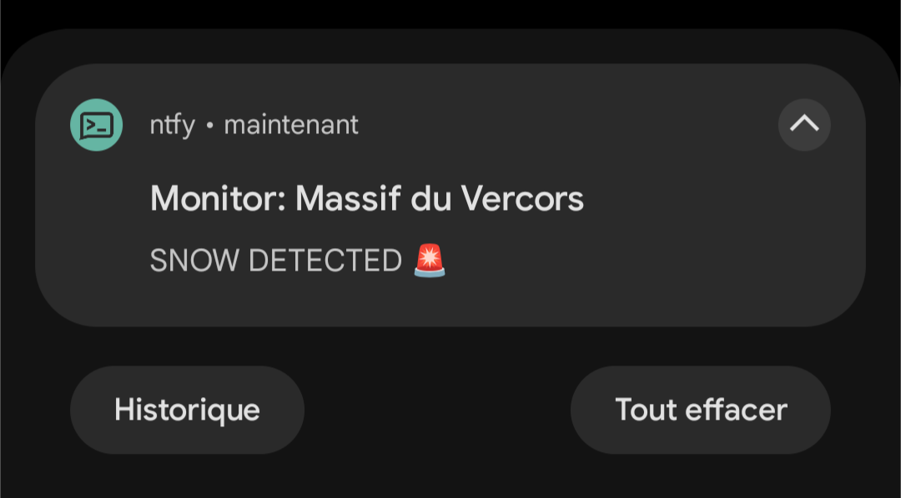

# Is there snow yet????



## About

_Go to the [Usage](#usage) part to see how to use it._

`itsy` is a CLI tool that checks if there's snow on a picture or not. How does it do? It simply verifies the presence of grey/white pixels (aka #C8C8C8) and count them. If there's more than `-threshold`% pixels in the whole image that are lighter than this color, then there's snow!

The image is fetched from the Internet by setting the `-img-url` flag, which comes handy when you want to monitor images from webcams. Currently only JPEGs are supported.

## Notifiers

`itsy` relies on what I called notifiers to ping you back. Currently, only [ntfy](https://ntfy.sh/) and the terminal (stdout) are supported. I personally recommend [ntfy](https://ntfy.sh/) because it's FOSS and works like a charm, especially if you want to receive notifications on your smartphone.

## Usage

* CLI options:

```
Usage of itsy:
  -img-url string
        url of the image to download (mandatory)
  -name string
        name of the monitor (default "snow monitor")
  -nfty-callback-address string
        if set, you'll be redirected to this address when opening the notification
  -nfty-embed-image
        if set, it will embed the downloaded image to the notification (if size < 2Mo)
  -nfty-topic string
        nfty topic to send notifications when using nfty notifier
  -notifier string
        select notifier to use (term, ntfy) (default "term")
  -snow-only
        send notification only if snow has been detected
  -threshold float
        confidence threshold, in percent (100 = absolutely sure) (default 25)
```

* Usage example using a cronjob and [ntfy](https://ntfy.sh/):

```
0 12 * * * /path/to/itsy -img-url "${IMG_URL?}" -name "${MONITOR_NAME?} (cron)" -notifier nfty -nfty-topic "${TOPIC?}" -threshold 25 -nfty-embed-image
```

## Note on reliability/disclaimer

As you may have guessed, due to the cheap way it "detects" snow presence, `itsy` is probably not very reliable as it, and the default threshold value may require some tweaking depending on the picture you're using.

## You without `itsy`

<details>

[](https://www.reddit.com/r/skiing/comments/cdtk89/waiting_for_winter_oc/)

</details>

## License

[MIT](https://choosealicense.com/licenses/mit/)